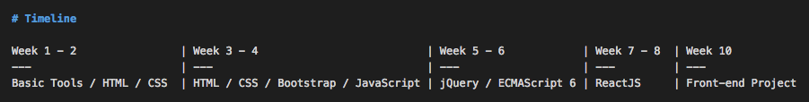

# Front-end Web-Development Part-Time 201805

[Git Cheat-sheet](https://github.github.com/training-kit/downloads/github-git-cheat-sheet.pdf)

[Repo](https://github.com/SkylabCoders/skylab-partTimeFront-201909)

[Slides](https://docs.google.com/presentation/d/1SBAsJr681fSjNqshJdWh64ZT5mNlqWLoKmVsw4M_aOI/edit?usp=sharing)

[Roadmap to becoming a web developer in 2018](https://github.com/kamranahmedse/developer-roadmap/blob/master/readme.md)

[React Developer Roadmap](https://hackernoon.com/the-2018-react-js-roadmap-4d0a43814c02)

[Consejos de los que ya han pasado por Skylab](https://youtu.be/ByBSPpA-Y_Y)